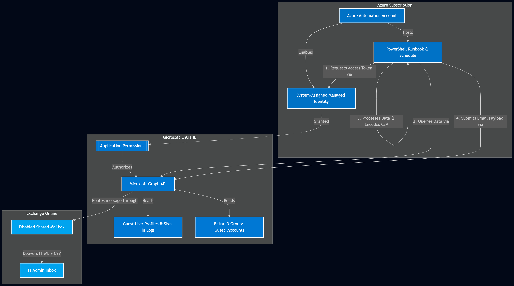

# Azure Automation: 180-Day Guest Inactivity Report

This guide explains how to set up an Azure Automation Account to automatically identify Guest users who have not logged in for over 180 days, and send a summary report via a Shared Mailbox.

This solution operates entirely headlessly using a **System-Assigned Managed Identity** and the **Microsoft Graph API**.

## Prerequisites
* An active Azure Subscription.
* Global Administrator or Privileged Role Administrator rights (to assign Graph API permissions).
* A Shared Mailbox in Exchange Online.
* The Object ID of an Entra ID Group (if you want to filter out specific guests).

---

## Architecture diagram



## Step 1: Create the Azure Automation Account
1. Log into the <a href="https://portal.azure.com" target="_blank" rel="noopener noreferrer">Azure Portal</a> and search for **Automation Accounts**.
2. Click **Create**, fill in your resource group and naming details, and deploy the resource.

## Step 2: Enable the Managed Identity
1. Navigate to your new Automation Account.
2. On the left menu, under **Account Settings**, select **Identity**.
3. Under the **System assigned** tab, set the Status to **On** and click **Save**.
4. Note the **Object (principal) ID** that is generated.

## Step 3: Grant Graph API Permissions
Because you cannot assign Microsoft Graph *Application* permissions to a Managed Identity via the Azure Portal GUI, you must use PowerShell.

Open an administrative PowerShell console, ensure the `Microsoft.Graph` module is installed, and run the following script. **Be sure to replace `$AppName` with the exact name of your Automation Account.**

<div style="position: relative; margin-bottom: 20px;">
  
  <button onclick="copyMyCode()" style="position: absolute; top: 10px; right: 10px; padding: 6px 12px; background-color: #0078D4; color: white; border: none; border-radius: 4px; cursor: pointer; font-weight: bold; box-shadow: 0 2px 4px rgba(0,0,0,0.2);">
    Copy Code
  </button>

  <pre style="max-height: 400px; overflow-y: auto; background-color: #1e1e1e; color: #d4d4d4; padding: 40px 15px 15px 15px; border-radius: 6px; border: 1px solid #333;">
<code id="psScript"># Paste your PowerShell script here
Connect-MgGraph -Scopes "AppRoleAssignment.ReadWrite.All", "Application.Read.All"

$AppName = "Your-Automation-Account-Name"
$ManagedIdentity = Get-MgServicePrincipal -Filter "displayName eq '$AppName'"
$GraphApp = Get-MgServicePrincipal -Filter "appId eq '00000003-0000-0000-c000-000000000000'"

# Required Graph API Permissions
$Roles = @(
    "User.Read.All", 
    "AuditLog.Read.All", 
    "Directory.Read.All", 
    "GroupMember.Read.All", 
    "Mail.Send"
)

foreach ($Role in $Roles) {
    $AppRole = $GraphApp.AppRoles | Where-Object { $_.Value -eq $Role }
    New-MgServicePrincipalAppRoleAssignment -PrincipalId $ManagedIdentity.Id -ServicePrincipalId $ManagedIdentity.Id -ResourceId $GraphApp.Id -AppRoleId $AppRole.Id
    Write-Host "Assigned $Role to $AppName"
}
</code>
  </pre>
</div>

<script>
  function copyMyCode() {
    var codeText = document.getElementById("psScript").innerText;
    navigator.clipboard.writeText(codeText).then(function() {
      alert("Script copied to clipboard!");
    });
  }
</script>


```

## Step 4: Create the Runbook
1. In your Automation Account, go to **Process Automation > Runbooks**.
2. Click **Create a runbook**. 
3. Name it (e.g., `Get-StaleGuestAccounts`), set the Runbook type to **PowerShell**, and set the Runtime version to **5.1** (or 7.2).
4. Download the script from this repository: 
   👉 <a href="https://github.com/AzureBrother/AzureBrother.github.io/blob/main/Get-StaleGuestAccounts.ps1" target="_blank" rel="noopener noreferrer">Get-StaleGuestAccounts.ps1</a>
6. Paste the code into the Azure Automation editor. *(Remember to update the configuration variables at the top of the script with your specific Group ID and email addresses).*
7. Click **Save**, test it using the **Test pane**, and then click **Publish**.

## Step 5: Schedule the Automation
Navigate to **Shared Resources > Schedules** and click **Add a schedule** (e.g., "Weekly on Mondays").

Go back to your published Runbook, click **Link to schedule**, and attach your new schedule.
